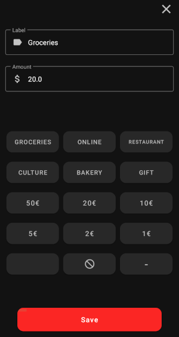

# Budget-Manager
The Budget Manager is a simple & intuitive app to track your incomes and expenses. 

## Features & Usage
### Start Screen
The start screen displays a simple overview on all expenses, incomes and remaining capital.

### Edit Screen
To ensure a quick and convenient input of new expenses or income, 6 buttons can be assigned to the most frequently 
used inputs/outputs. The screenshot displays the default settings for the 6 buttons. Similarly, for the amount of money, 
multiple presses of the button will accumulate the values.

### Rename Quick-Buy-Buttons 
If the predefined labels or money amounts are not suitable, users can modify them by long-pressing the respective 
buttons. If the new label is too long to fit on the button, the font size can also be adjusted.

### Swipe to delete 
Quickly delete wrong incoming or expenses with one swipe.

## Installation
Download the Budget-Manager.apk from the releases.