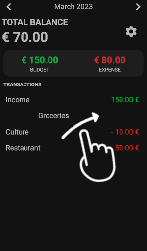

# Budget-Manager
The Budget Manager is a simple & intuitive Android-App to track your incomes and expenses. 

## Features & Usage
### Start Screen
The start screen displays a simple overview on all expenses, incomes and remaining capital.

### Edit Screen
To ensure a quick and convenient input of new expenses or income, six buttons can be assigned to the most frequently 
incomes/expenses. The screenshot displays the default settings for the six buttons. The same principle applies when 
entering the price, where the total price results from clicking on the different values multiple times.

### Rename Quick-Buy-Buttons 
If the predefined labels or money amounts are not suitable, users can modify them by long-pressing the respective 
buttons. If the new label is too long to fit on the button, the font size can also be adjusted.

### Swipe to delete 
Quickly delete wrong incoming or expenses with one swipe.

## Installation
Download the Budget-Manager.apk from the releases.